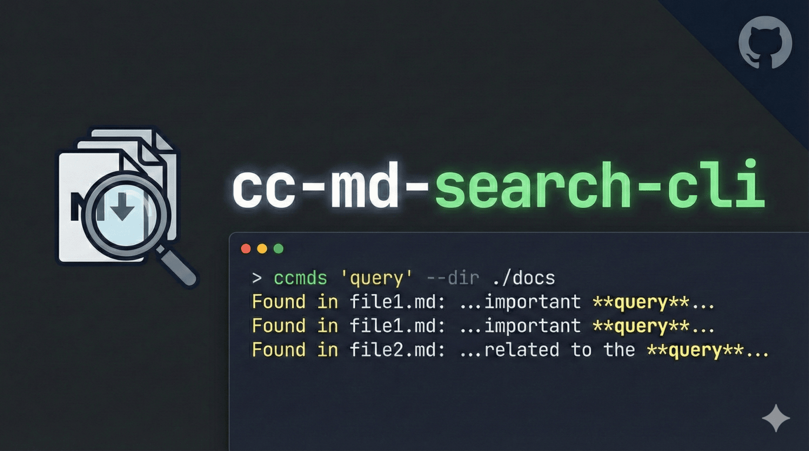

# CC-MD-Search-CLI

**Claude Code Markdown Search - Efficient documentation search CLI for AI coding assistants**

Fast, context-efficient markdown documentation search tool designed for [Claude Code](https://claude.ai/claude-code) and [Cursor IDE](https://cursor.com). Quickly find relevant information across large documentation sets without loading entire files into context.

## Features

- **Fuzzy Search** - Find relevant docs even with typos or variations
- **Pattern/Regex Search** - Exact matches with regex support
- **Smart Context** - Paragraph and code-block aware context extraction
- **Heading Paths** - Shows parent heading hierarchy for each match
- **Document Outlines** - View document structure without content
- **Section Extraction** - Fetch specific sections by heading
- **Frontmatter Aware** - Parses YAML metadata for better search
- **Adaptive Previews** - Top results get longer previews automatically
- **Multiple Output Modes** - compact, detailed, files, json
- **Claude Code Skill** - Pre-built skill template for Claude Code integration
- **Cursor Rule** - Pre-built rule template for Cursor IDE integration
- **Context Efficient** - Minimize token usage when searching docs

## Installation

### Prerequisites

- [Bun](https://bun.sh/) (recommended) or Node.js 18+
- npm or pnpm

### Install

```bash
# Clone the repository
git clone https://github.com/bjeber/cc-md-search-cli.git
cd cc-md-search-cli

# Install dependencies
bun install
# or: npm install

# Link the CLI globally
npm link
```

After linking, the `ccmds` command will be available globally.

## Quick Start

```bash
# List all markdown files in a directory
ccmds list ./docs

# List files from multiple directories
ccmds list ./docs ./api/docs ./guides

# Fuzzy search for relevant documents
ccmds find "authentication" ./docs -l 5

# Search across multiple directories
ccmds find "authentication" ./docs ./api/docs ./guides -l 5

# Pattern search with regex (smart context preserves code blocks)
ccmds grep "TODO|FIXME" ./docs

# Grep across multiple directories
ccmds grep "TODO|FIXME" ./docs ./api/docs

# View document structure without content
ccmds outline ./docs

# View structure across multiple directories
ccmds outline ./docs ./api/docs -d 2

# Extract a specific section by heading
ccmds section ./docs/setup.md "Installation"

# Show a specific file
ccmds show ./docs/api/auth.md
```

## Commands

### `ccmds find <query> [directories...]` - Fuzzy Search

Find relevant documents using fuzzy matching with extended search syntax. Great for exploratory searches. Features adaptive preview lengths (top results get more content) and filtered frontmatter. Supports searching across multiple directories simultaneously.

**Extended Search Syntax:**
| Pattern | Meaning | Example |
|---------|---------|---------|
| `word1 word2` | AND (all must match) | `auth setup` |
| `word1 \| word2` | OR (either matches) | `install \| setup` |
| `'exact` | Exact substring | `'authentication` |
| `^prefix` | Starts with | `^Config` |
| `suffix$` | Ends with | `Guide$` |

```bash
ccmds find "authentication middleware" ./docs -l 5  # AND search
ccmds find "setup | installation" ./docs            # OR search
ccmds find "'API Reference" ./docs -o files         # Exact match
ccmds find "deploy" ./docs --raw                    # Disable optimizations
```

**Options:**
- `-l, --limit <number>` - Maximum results (default: 10)
- `-o, --output <mode>` - Output format: compact, detailed, files, json
- `-r, --raw` - Disable adaptive previews and frontmatter filtering

### `ccmds grep <pattern> [directories...]` - Pattern Search

Search for exact text patterns with regex support. Uses smart context that preserves code blocks and paragraph boundaries, and shows heading paths for each match. Supports searching across multiple directories simultaneously.

```bash
ccmds grep "ERROR_[0-9]+" ./docs
ccmds grep "GraphQL" ./docs --case-sensitive
ccmds grep "TODO" ./docs --raw -c 3  # Line-based context instead
```

**Options:**
- `-c, --context <lines>` - Lines of context around matches (default: 2, used with --raw)
- `-s, --case-sensitive` - Case sensitive search
- `-o, --output <mode>` - Output format
- `-r, --raw` - Disable smart context (use line-based context)

### `ccmds list [directories...]` - List Files

List all markdown files in one or more directories.

```bash
ccmds list ./docs
ccmds list ./docs --count
```

**Options:**
- `-c, --count` - Show only file count

### `ccmds show <file>` - Display File

Show the full content of a markdown file.

```bash
ccmds show ./docs/api/auth.md
ccmds show ./docs/guide.md --frontmatter-only
ccmds show ./docs/guide.md --body-only
```

**Options:**
- `-f, --frontmatter-only` - Show only YAML frontmatter
- `-b, --body-only` - Show only body content

### `ccmds outline [paths...]` - Document Structure

Show document structure (headings only) without content. Great for understanding document organization. Supports files, directories, or multiple paths.

```bash
ccmds outline ./docs/guide.md           # Single file
ccmds outline ./docs                     # All files in directory
ccmds outline ./docs -d 2                # Limit to h1 and h2
ccmds outline ./docs -o json             # JSON output
```

**Options:**
- `-d, --depth <number>` - Maximum heading depth (default: 6)
- `-o, --output <mode>` - Output format: text, json

### `ccmds section <file> <heading>` - Extract Section

Extract a specific section by heading text. Useful for fetching just the content you need.

```bash
ccmds section ./docs/setup.md "Installation"
ccmds section ./docs/api.md "Authentication"
ccmds section ./docs/guide.md "Setup > Prerequisites"  # Nested heading
ccmds section ./docs/api.md "Endpoints" -o json
```

**Options:**
- `-o, --output <mode>` - Output format: text, json

## Claude Code Integration

To use this tool with Claude Code, install the skill to your Claude Code skills directory.

### 1. Install the Skill

```bash
# Create the skill directory
mkdir -p ~/.claude/skills/md-search

# Copy the skill file
cp skills/SKILL.md ~/.claude/skills/md-search/SKILL.md
```

### 2. Use with Claude Code

Once installed, the skill will be available as `/md-search`. Claude Code can automatically search your documentation when you ask questions:

- "How do I set up authentication?"
- "What are the API endpoints?"
- "Where is the deployment guide?"

Claude will use `ccmds` to search your documentation with minimal context usage.

### 3. Skill Structure

The skill follows Claude Code's skill format:

```
~/.claude/skills/md-search/
└── SKILL.md          # Skill definition with YAML frontmatter
```

The SKILL.md includes:
- **YAML frontmatter** with `name` and `description` for skill registration
- **Command reference** for all `ccmds` commands
- **Workflow strategies** for efficient documentation search
- **Best practices** for context-efficient searches

## Cursor Integration

To use this tool with Cursor IDE, install the rule to your project's `.cursor/rules/` directory.

### 1. Install the Rule

```bash
# Create the rules directory in your project
mkdir -p .cursor/rules

# Copy the rule file
cp rules/docs-search.mdc .cursor/rules/docs-search.mdc
```

### 2. Configure Your Docs Path

Edit `.cursor/rules/docs-search.mdc` and update the `DOCS_PATH` variable at the top:

```markdown
## Configuration

**DOCS_PATH**: `./docs`  # Change this to your docs directory
```

Replace `./docs` with your actual documentation path (e.g., `./documentation`, `./docs/api`, etc.).

### 3. Use with Cursor

Once installed, Cursor will automatically include this rule when relevant (Agent Requested mode). The rule activates when you ask questions about documentation:

- "How do I set up authentication?"
- "What are the API endpoints?"
- "Where is the deployment guide?"

Cursor will use `ccmds` to search your documentation with minimal context usage.

### 4. Rule Structure

The rule follows Cursor's `.mdc` format:

```
.cursor/rules/
└── docs-search.mdc    # Rule definition with YAML frontmatter
```

The rule includes:
- **YAML frontmatter** with `description` for Agent Requested mode
- **Configurable DOCS_PATH** at the top for easy customization
- **Command reference** for all `ccmds` commands
- **Workflow strategies** for efficient documentation search
- **Best practices** for context-efficient searches

## Output Modes

| Mode | Description | Use Case |
|------|-------------|----------|
| `files` | File paths only | Quick overview, piping to other commands |
| `compact` | Paths + snippets | Default, balanced context |
| `detailed` | Full context | Deep investigation |
| `json` | JSON output | Programmatic processing |

## Workflow Tips

### Progressive Search

1. Start with `outline` to understand document structure
2. Use `find` to discover relevant docs
3. Use `section` to extract just what you need

```bash
# Understand structure
ccmds outline ./docs -d 2

# Discover relevant docs
ccmds find "database" ./docs -o files

# Extract specific section
ccmds section ./docs/database/migrations.md "Schema Changes"
```

### Smart Context Search

Grep automatically preserves code blocks and shows heading paths:

```bash
# Search returns full code blocks when match is inside one
ccmds grep "npm install" ./docs

# Output shows heading path:
# ◆ ## Installation > ### Prerequisites (lines 10-25)
# ```bash
# npm install my-package
# ```
```

### Quick Lookup

```bash
# Find and show top result
ccmds find "installation" ./docs -l 1 -o files | xargs ccmds show

# Or extract just the installation section
ccmds section ./docs/setup.md "Installation"
```

## Documentation Structure (Recommended)

For best search results, organize your docs with clear structure:

```
docs/
├── setup/              # Installation & setup
├── api/                # API documentation
├── guides/             # How-to guides
├── architecture/       # System design
├── troubleshooting/    # Common issues
└── reference/          # Quick references
```

### Frontmatter

Add YAML frontmatter for better search relevance:

```markdown
---
title: API Authentication Guide
tags: [api, auth, security]
category: api
---

# API Authentication
...
```

## Configuration

See [CONFIGURATION.md](./CONFIGURATION.md) for detailed configuration options.

## License

MIT License - see [LICENSE](./LICENSE) file.

## Contributing

Contributions are welcome! Please open an issue or submit a pull request.
